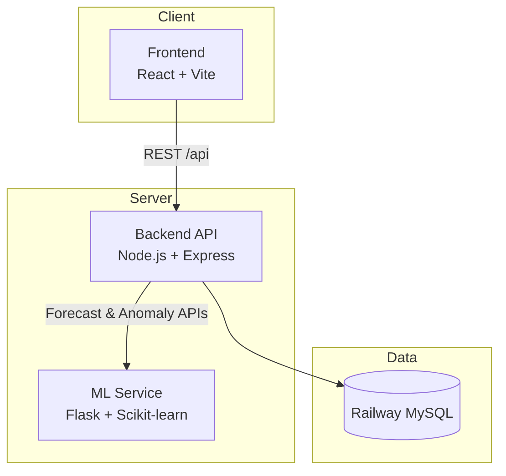

# SpendWise Pro 💰🤖


**AI-powered Personal Finance Management Platform** with expense tracking, budgeting, machine-learning forecasts, anomaly detection, and intelligent financial insights.

---

## 🚀 Live Demo

- 🌐 Live Application: [SpenWuse Pro](https://spendwise-pro-nu.vercel.app)

---

## Table of Contents

- [Features](#features)
- [Tech Stack](#tech-stack)
- [Architecture](#architecture)
- [Project Structure](#project-structure)
- [Screenshots](#screenshots)
- [Local Development](#local-development)
- [Environment Variables](#environment-variables)
- [API Overview](#api-overview)
- [Deployment](#deployment)
- [Author](#author)
- [License](#license)

---

## Features

| Area                       | Capabilities                                                                |
| -------------------------- | --------------------------------------------------------------------------- |
| **Expense Tracking**       | Add, update, and delete expenses with categories, notes, and dates          |
| **Budget Management**      | Set overall and category budgets with real-time utilization tracking        |
| **Analytics Dashboard**    | Monthly trends, category breakdowns, top spending categories, and summaries |
| **AI Financial Assistant** | Natural-language queries about spending, budgets, forecasts, and profile    |
| **Spending Forecasting**   | ML-powered next-month spending predictions                                  |
| **Anomaly Detection**      | Detect unusual spending behavior using Isolation Forest                     |
| **Intelligent Insights**   | Auto-generated insights and savings recommendations                         |
| **Financial Health**       | Dynamic health score with personalized recommendations                      |
| **Notifications**          | In-app alerts for budget and spending events                                |
| **Authentication**         | JWT-based authentication with email verification and password reset         |
| **Profile & Avatar**       | Profile management with secure avatar upload                                |
| **Security**               | Helmet, rate limiting, input validation, and CORS hardening                 |
| **Deployment**             | Production-ready cloud deployment using Vercel and Railway                  |

---

## Tech Stack

### Frontend

- React 19 + TypeScript
- Vite
- Tailwind CSS
- React Router
- Axios
- Recharts

### Backend

- Node.js + Express.js
- MySQL 8
- JWT Authentication
- bcrypt
- Multer
- Nodemailer
- Helmet
- express-rate-limit
- express-validator

### Machine Learning

- Flask
- Scikit-learn
  - Linear Regression
  - Isolation Forest
- Pandas
- NumPy

---

## Architecture



| Service     | Platform         |
| ----------- | ---------------- |
| Frontend    | Vercel           |
| Backend API | Railway          |
| ML Service  | Railway / Render |
| Database    | Railway MySQL    |

---

## Project Structure

```text
SpendWise-Pro/
├── Backend/
│   ├── controllers/
│   ├── routes/
│   ├── services/
│   ├── middleware/
│   ├── schema/
│   └── uploads/
├── Frontend/
│   └── src/
├── ML-Service/
│   ├── app.py
│   ├── model.py
│   └── anomaly.py
├── screenshots/
│   ├── landing-page.png
│   ├── dashboard.png
│   ├── transactions.png
│   ├── budgets.png
│   ├── analytics.png
│   └── chatbot.png
├── .env.example
└── README.md
```

---

## Screenshots

### Landing Page


### Dashboard Overview


### Transactions Management


### Budget Tracking


### Analytics Dashboard


### AI Financial Assistant


---

## Local Development

### Database

```bash
mysql -u root -p -e "CREATE DATABASE spendwise;"
mysql -u root -p spendwise < Backend/schema/schema.sql
```

### Backend

```bash
cd Backend
npm install
npm start
```

Runs on: `http://localhost:5000`

### ML Service

```bash
cd ML-Service
pip install -r requirements.txt
python app.py
```

Runs on: `http://localhost:5001`

### Frontend

```bash
cd Frontend
npm install
npm run dev
```

Runs on: `http://localhost:5173`

---

## Environment Variables

```env
JWT_SECRET=
DB_HOST=
DB_PORT=
DB_USER=
DB_PASSWORD=
DB_NAME=spendwise

SMTP_USER=
SMTP_PASS=

FRONTEND_URL=
ML_SERVICE_URL=

VITE_API_BASE_URL=<BACKEND_API_URL>/api
```

---

## API Overview

| Prefix               | Purpose             |
| -------------------- | ------------------- |
| `/api/auth`          | Authentication      |
| `/api/expenses`      | Expense CRUD        |
| `/api/categories`    | Category CRUD       |
| `/api/budgets`       | Budget CRUD         |
| `/api/analytics`     | Dashboard analytics |
| `/api/forecast`      | ML forecasting      |
| `/api/anomaly`       | Anomaly detection   |
| `/api/ai`            | AI assistant        |
| `/api/intelligence`  | Recommendations     |
| `/api/notifications` | Notifications       |
| `/api/user`          | Avatar management   |

### ML Service Endpoints

| Method | Endpoint    |
| ------ | ----------- |
| GET    | `/health`   |
| POST   | `/forecast` |
| POST   | `/anomaly`  |

---

## Deployment

The application is deployed using modern cloud infrastructure:

- **Frontend:** Vercel
- **Backend API:** Railway
- **ML Service:** Railway / Render
- **Database:** Railway MySQL

---

## Author

**Ishaan Saxena**

- GitHub: [IshaanSaxena2005](https://github.com/IshaanSaxena2005)
- Project: SpendWise Pro
- Full-stack AI-powered personal finance platform

---

## License

This project is licensed under the **MIT License**.
