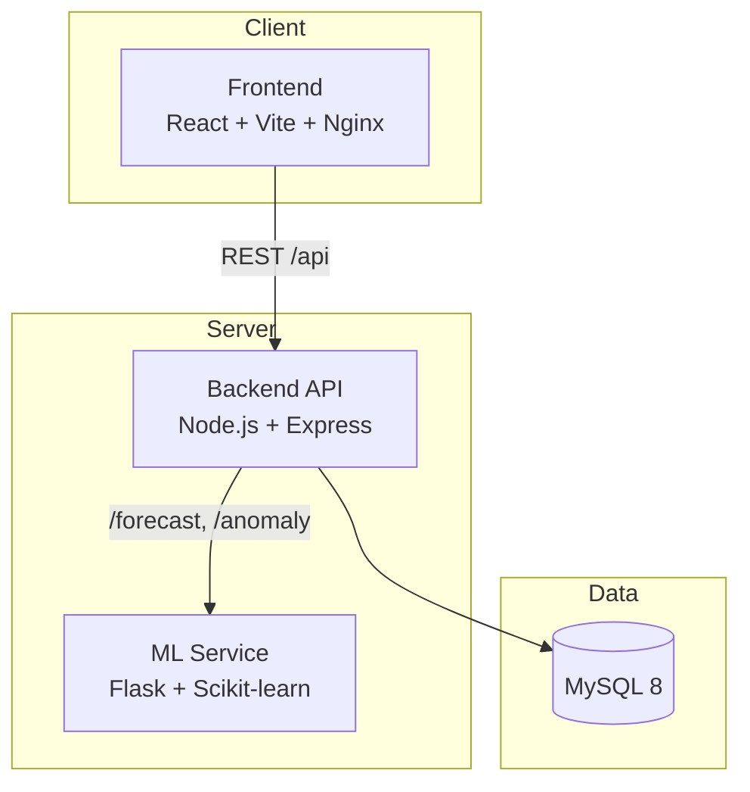

# SpendWise Pro 💰🤖

**AI-powered Personal Finance Management Platform** with expense tracking, budgeting, machine-learning forecasts, anomaly detection, and intelligent financial insights.

---

## Table of Contents

- [Features](#features)
- [Tech Stack](#tech-stack)
- [Architecture](#architecture)
- [Project Structure](#project-structure)
- [Screenshots](#screenshots)
- [Quick Start (Docker)](#quick-start-docker)
- [Local Development](#local-development)
- [Environment Variables](#environment-variables)
- [API Overview](#api-overview)
- [Project Status](#project-status)
- [License](#license)

---

## Features

| Area | Capabilities |
|------|-------------|
| **Expense Tracking** | Add, update, and delete expenses with categories, notes, and dates |
| **Budget Management** | Set overall or per-category monthly budgets and track utilization |
| **Analytics Dashboard** | Monthly trends, category breakdowns, top spending categories, and summaries |
| **AI Financial Assistant** | Natural-language queries about spending, budgets, forecasts, and profile |
| **Spending Forecasting** | Linear Regression–based next-month spending predictions with MAE, RMSE, and R² |
| **Anomaly Detection** | Isolation Forest flags unusual transactions against spending history |
| **Intelligent Insights** | Auto-generated insights and savings recommendations |
| **Financial Health** | Health score, budget-breach predictions, and overspending alerts |
| **Notifications** | In-app alerts for budget and spending events |
| **Authentication** | JWT-based auth with email verification and password reset |
| **Profile & Avatar** | Profile management with secure avatar upload (Multer) |
| **Security** | Helmet, rate limiting, input validation, and CORS hardening |
| **DevOps** | Fully Dockerized multi-service architecture |

---

## Tech Stack

### Frontend
- **React 19** + **TypeScript**
- **Vite** — fast dev server and production builds
- **Tailwind CSS 4** — utility-first styling
- **Recharts** — interactive charts and analytics
- **React Router** — client-side routing
- **Axios** — API communication

### Backend
- **Node.js** + **Express.js**
- **MySQL 8** — relational data store
- **JWT** — stateless authentication
- **bcrypt** — password hashing
- **Multer** — avatar file uploads
- **Nodemailer** — email verification and password reset
- **Helmet** + **express-rate-limit** + **express-validator** — security layer

### Machine Learning
- **Flask** — lightweight ML microservice
- **Scikit-learn** — Linear Regression (forecasting) & Isolation Forest (anomalies)
- **Pandas** & **NumPy** — data processing

### DevOps
- **Docker** & **Docker Compose** — containerized deployment
- **Nginx** — production frontend serving

---

## Architecture



| Service | Port | Description |
|---------|------|-------------|
| Frontend | `80` | React SPA served via Nginx |
| Backend | `5000` | REST API and business logic |
| ML Service | `5001` | Forecasting and anomaly detection |
| MySQL | `3307` (host) → `3306` (container) | Persistent data storage |

---

## Project Structure

```
spendwise-pro/
├── Backend/
│   ├── controllers/       # Route handlers
│   ├── routes/            # Express route definitions
│   ├── services/          # AI chat, anomaly, email logic
│   ├── middleware/        # Auth, rate limiting, validation
│   ├── schema/            # MySQL schema (auto-loaded in Docker)
│   └── uploads/           # User avatar storage
├── Frontend/
│   └── src/
│       ├── components/    # UI components & dashboard pages
│       ├── lib/           # API client
│       └── pages/         # Standalone pages (e.g. forgot password)
├── ML-Service/
│   ├── app.py             # Flask API (/health, /forecast, /anomaly)
│   ├── model.py           # Linear Regression forecaster
│   └── anomaly.py         # Isolation Forest detector
├── docker-compose.yml
├── .env.example
└── README.md
```

---

## Screenshots

> Add screenshots to the `screenshots/` folder when available.

### Dashboard


### AI Chat


### Analytics


---

## Quick Start (Docker)

**Prerequisites:** [Docker](https://www.docker.com/) and [Docker Compose](https://docs.docker.com/compose/)

1. **Clone the repository**
   ```bash
   git clone <repository-url>
   cd spendwise-pro
   ```

2. **Configure environment**
   ```bash
   cp .env.example .env
   ```
   Edit `.env` and set a strong `JWT_SECRET` and SMTP credentials for email features.

3. **Build and run all services**
   ```bash
   docker compose up --build
   ```

4. **Access the application**

   | Service | URL |
   |---------|-----|
   | Frontend | http://localhost |
   | Backend API | http://localhost:5000 |
   | ML Service Health | http://localhost:5001/health |
   | MySQL (from host) | `localhost:3307` |

The database schema is automatically applied on first startup via `Backend/schema/schema.sql`.

To stop all services:
```bash
docker compose down
```

---

## Local Development

**Prerequisites:** Node.js 20+, Python 3.10+, MySQL 8

### 1. Database

Create a MySQL database and import the schema:

```bash
mysql -u root -p -e "CREATE DATABASE spendwise;"
mysql -u root -p spendwise < Backend/schema/schema.sql
```

### 2. Backend

```bash
cd Backend
npm install
```

Create `Backend/.env`:

```env
PORT=5000
JWT_SECRET=your-secret-key
DB_HOST=localhost
DB_PORT=3306
DB_USER=root
DB_PASSWORD=your-password
DB_NAME=spendwise
ML_SERVICE_URL=http://localhost:5001
FRONTEND_URL=http://localhost:5173
BACKEND_URL=http://localhost:5000
SMTP_USER=your-email@example.com
SMTP_PASS=your-smtp-password
NODE_ENV=development
```

```bash
npm start
```

### 3. ML Service

```bash
cd ML-Service
pip install -r requirements.txt
python app.py
```

Runs on http://localhost:5001

### 4. Frontend

```bash
cd Frontend
npm install
npm run dev
```

Runs on http://localhost:5173

Optionally create `Frontend/.env`:

```env
VITE_API_BASE_URL=http://localhost:5000/api
```

---

## Environment Variables

Copy `.env.example` to `.env` at the project root for Docker, or configure per-service `.env` files for local development.

| Variable | Required | Description |
|----------|----------|-------------|
| `MYSQL_ROOT_PASSWORD` | Docker | MySQL root password |
| `DB_NAME` | Yes | Database name (default: `spendwise`) |
| `DB_USER` | Yes | MySQL application user |
| `DB_PASSWORD` | Yes | MySQL application password |
| `DB_HOST` | Local | Database host (use `mysql` in Docker) |
| `DB_PORT` | Local | Database port (default: `3306`) |
| `JWT_SECRET` | Yes | Secret key for signing JWT tokens |
| `PORT` | Backend | API port (default: `5000` in Docker) |
| `ML_SERVICE_URL` | Backend | ML service URL (default: `http://ml-service:5001`) |
| `FRONTEND_URL` | Yes | Frontend origin for CORS and email links |
| `BACKEND_URL` | Yes | Backend URL for verification email links |
| `SMTP_USER` | Email | SMTP account username |
| `SMTP_PASS` | Email | SMTP account password |
| `SMTP_HOST` | Optional | SMTP server (default: `smtp.gmail.com`) |
| `SMTP_PORT` | Optional | SMTP port (default: `587`) |
| `NODE_ENV` | Optional | `development` or `production` |
| `VITE_API_BASE_URL` | Frontend | API base URL (default: `http://localhost:5000/api`) |

> Email verification and password reset require valid `SMTP_USER` and `SMTP_PASS`. Without them, auth still works but emails are skipped in development.

---

## API Overview

All authenticated routes require a `Authorization: Bearer <token>` header.

| Prefix | Endpoints |
|--------|-----------|
| `/api/auth` | Signup, login, profile, email verification, password reset |
| `/api/expenses` | CRUD expense records |
| `/api/categories` | CRUD spending categories |
| `/api/budgets` | CRUD monthly budgets |
| `/api/analytics` | Dashboard summary, trends, category breakdown |
| `/api/forecast` | Next-month spending forecast (ML) |
| `/api/anomaly` | Unusual spending detection (ML) |
| `/api/ai` | AI financial assistant chat |
| `/api/intelligence` | Insights and recommendations |
| `/api/health` | Financial health score |
| `/api/predictions` | Budget breach prediction |
| `/api/notifications` | User notifications |
| `/api/user` | Avatar upload and management |

**ML Service endpoints:**

| Method | Path | Description |
|--------|------|-------------|
| `GET` | `/health` | Service health check |
| `POST` | `/forecast` | Predict next month's spending from history |
| `POST` | `/anomaly` | Detect anomalous expense against history |

---

## Project Status

| Phase | Status |
|-------|--------|
| Phase 10: ML Forecasting | ✅ Complete |
| Phase 11: Anomaly Detection | ✅ Complete |
| Phase 14: Security Hardening | ✅ Complete |
| Phase 15: Dockerization | ✅ Complete |
| Phase 16: Deployment | 🚀 Upcoming |

---

## License

This project is licensed under the **MIT License**.
