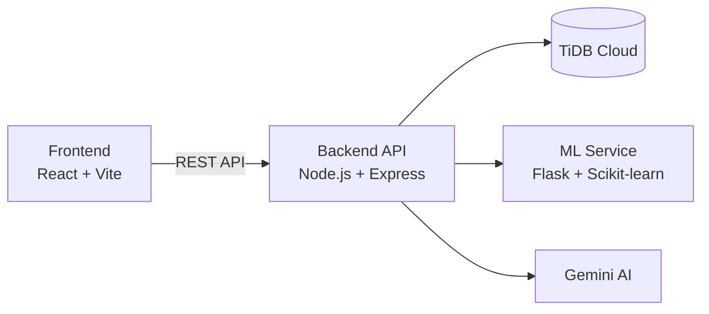
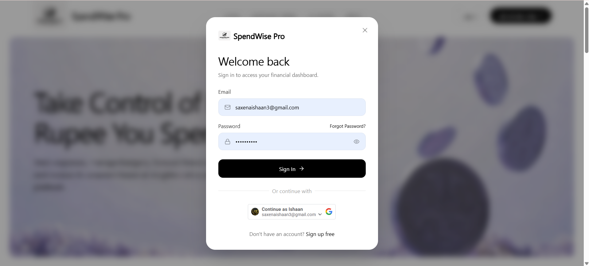
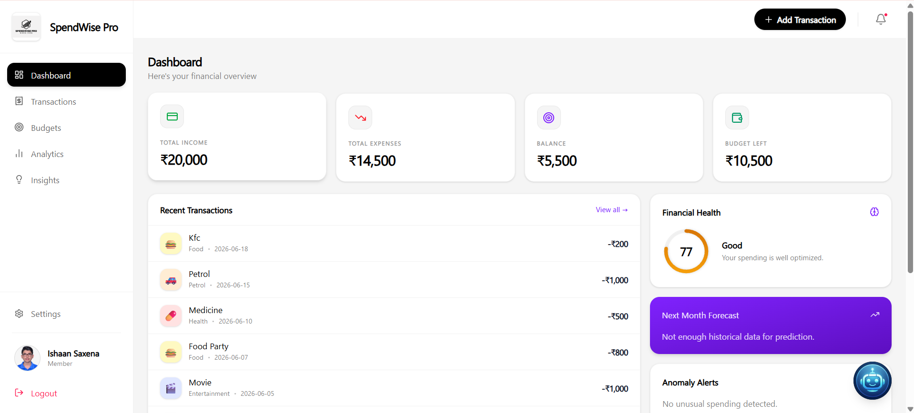
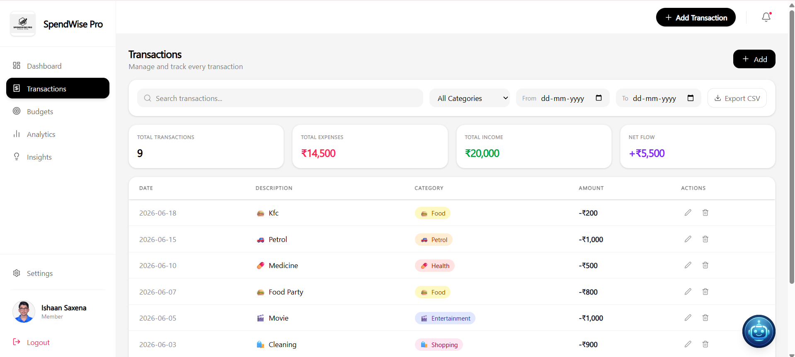
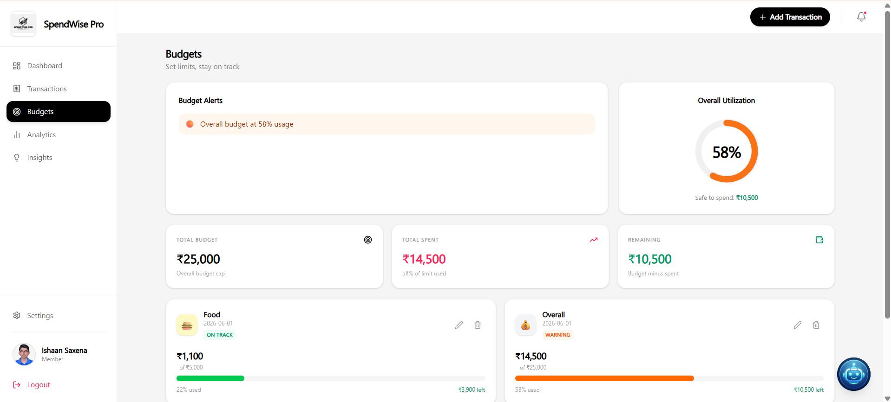
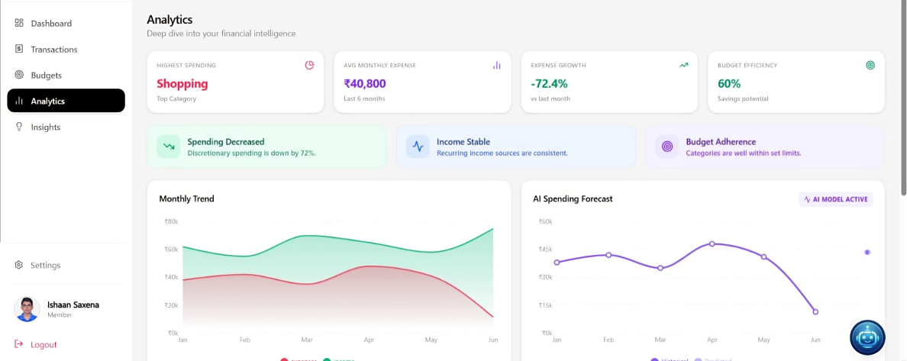
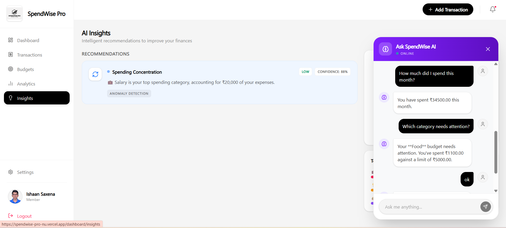
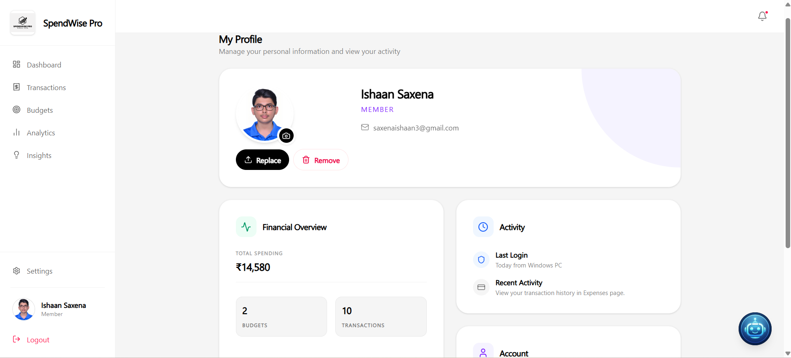

# SpendWise Pro 💰🤖


**AI-powered Personal Finance Management Platform** featuring intelligent expense tracking, self-learning smart categorization, recurring transactions, financial goals, budgeting, analytics, ML-powered forecasting, anomaly detection, AI insights, and secure cloud deployment.

---

## 🚀 Live Demo

- Frontend: https://spendwise-pro-nu.vercel.app/

---

## Table of Contents

- [Features](#features)
- [Tech Stack](#tech-stack)
- [Architecture](#architecture)
- [Project Structure](#project-structure)
- [Screenshots](#screenshots)
- [Local Development](#local-development)
- [Environment Variables](#environment-variables)
- [API Overview](#api-overview)
- [Deployment](#deployment)
- [Author](#author)

---

## Features

| Area | Capabilities |
|------|--------------|
| **Smart Expense Tracking** | Add, edit, delete, search, filter and export transactions |
| **Self-Learning AI Categorization** | Automatically categorizes transactions using keywords, fuzzy matching, AI, and personalized learning |
| **Recurring Transactions** | Daily, weekly, monthly and yearly recurring expenses & income |
| **Smart Financial Goals** | AI-assisted goals with progress tracking, completion prediction and milestone notifications |
| **Budget Management** | Overall and category-wise budgets with utilization tracking |
| **Analytics Dashboard** | Spending trends, category breakdown, savings insights and monthly summaries |
| **AI Financial Assistant** | Natural language financial queries powered by Gemini AI |
| **Spending Forecasting** | Machine learning prediction of future expenses |
| **Anomaly Detection** | Isolation Forest based unusual spending detection |
| **Financial Health Score** | Personalized financial health analysis with recommendations |
| **Notifications** | Budget alerts, recurring reminders and goal milestone notifications |
| **Authentication & Security** | JWT, Email Verification, Password Reset, Google OAuth, Rate Limiting |
| **Profile Management** | Avatar upload and profile customization |
| **Cloud Deployment** | Production-ready deployment on Vercel + Render + TiDB Cloud |

---

## Tech Stack

### Frontend

- React 19 + TypeScript
- Vite
- Tailwind CSS
- React Router
- Axios
- Recharts

### Backend

- Node.js + Express.js
- MySQL 8
- JWT Authentication
- bcrypt
- Multer
- Nodemailer
- Helmet
- express-rate-limit
- express-validator
- Gemini AI API

### AI & Machine Learning

- Python
- Flask
- Scikit-learn
- Pandas
- NumPy
- Gemini AI API
- Rule-based NLP Engine
- Fuzzy String Matching
- Self-Learning Categorization Engine
- Linear Regression
- Isolation Forest
---

## Architecture



| Service     | Platform         |
| ----------- | ---------------- |
| Frontend    | Vercel           |
| Backend API | Railway          |
| ML Service  | Railway / Render |
| Database    | Railway MySQL    |

---

## Project Structure

```text
SpendWise-Pro/
├── Backend/
│   ├── controllers/
│   ├── routes/
│   ├── services/
│   ├── middleware/
│   ├── schema/
│   └── uploads/
├── Frontend/
│   └── src/
├── ML-Service/
│   ├── app.py
│   ├── model.py
│   └── anomaly.py
├── screenshots/
├   ├── home.png
├   ├── login.png
├   ├── dashboard.png
├   ├── transactions.png
├   ├── budgets.png
├   ├── analytics.png
├   ├── chatbot.png
├   └── profile.png
├── .env.example
└── README.md

```

## 📸 Screenshots

### 🏠 Landing Page


### 🔐 Login


### 📊 Dashboard


### 💰 Expense Management


### 🎯 Budget Management


### 📈 Analytics Dashboard


### 🤖 AI Financial Assistant


### 👤 User Profile


---

## Local Development

### Database

```bash
mysql -u root -p -e "CREATE DATABASE spendwise;"
mysql -u root -p spendwise < Backend/schema/schema.sql
```

### Backend

```bash
cd Backend
npm install
npm start
```

Runs on: `http://localhost:5000`

### ML Service

```bash
cd ML-Service
pip install -r requirements.txt
python app.py
```

Runs on: `http://localhost:5001`

### Frontend

```bash
cd Frontend
npm install
npm run dev
```

Runs on: `http://localhost:5173`

---

## Environment Variables

```env
MYSQL_ROOT_PASSWORD=
DB_NAME=
DB_USER=
DB_PASSWORD=
DB_HOST=
DB_PORT=

JWT_SECRET=

NODE_ENV=

BACKEND_URL=
FRONTEND_URL=
ML_SERVICE_URL=

CORS_ORIGIN=


GOOGLE_CLIENT_ID=

CLOUDINARY_CLOUD_NAME=
CLOUDINARY_API_KEY=
CLOUDINARY_API_SECRET=

GEMINI_API_KEY=
BREVO_API_KEY=
```

### Frontend

```env
VITE_API_BASE_URL=
VITE_GOOGLE_CLIENT_ID=
```

---

## API Overview

| Prefix               | Purpose             |
| -------------------- | ------------------- |
| `/api/auth`          | Authentication      |
| `/api/expenses`      | Expense CRUD        |
| `/api/categories`    | Category CRUD       |
| `/api/budgets`       | Budget CRUD         |
| `/api/analytics`     | Dashboard analytics |
| `/api/forecast`      | ML forecasting      |
| `/api/anomaly`       | Anomaly detection   |
| `/api/ai`            | AI assistant        |
| `/api/intelligence`  | Recommendations     |
| `/api/notifications` | Notifications       |
| `/api/user`          | Avatar management   |
| `/api/goals` | Smart Financial Goals |
| `/api/recurring` | Recurring Transactions |
| `/api/forecast` | ML Forecasting |
| `/api/categorize` | Smart Category Detection |

### ML Service Endpoints

| Method | Endpoint    |
| ------ | ----------- |
| GET    | `/health`   |
| POST   | `/forecast` |
| POST   | `/anomaly`  |

---

## Deployment

The application is deployed using modern cloud infrastructure:

- **Frontend:** Vercel
- **Backend API:** Render
- **Database:** TiDB Cloud
- **Machine Learning:** Flask Service
- **AI Provider:** Google Gemini

---

## ⭐ Highlights

- 🧠 Self-Learning AI Smart Categorization Engine
- 🔁 Recurring Income & Expense Management
- 🎯 AI-assisted Financial Goal Tracking
- 📈 Machine Learning Spending Forecasts
- 🚨 Isolation Forest Anomaly Detection
- 🤖 Gemini-powered Financial Assistant
- 📊 Interactive Analytics Dashboard
- ☁️ Production-ready Cloud Deployment

---

## Author

**Ishaan Saxena**

- GitHub: https://github.com/IshaanSaxena2005
- Project: SpendWise Pro
- Full-stack AI-powered personal finance platform

---