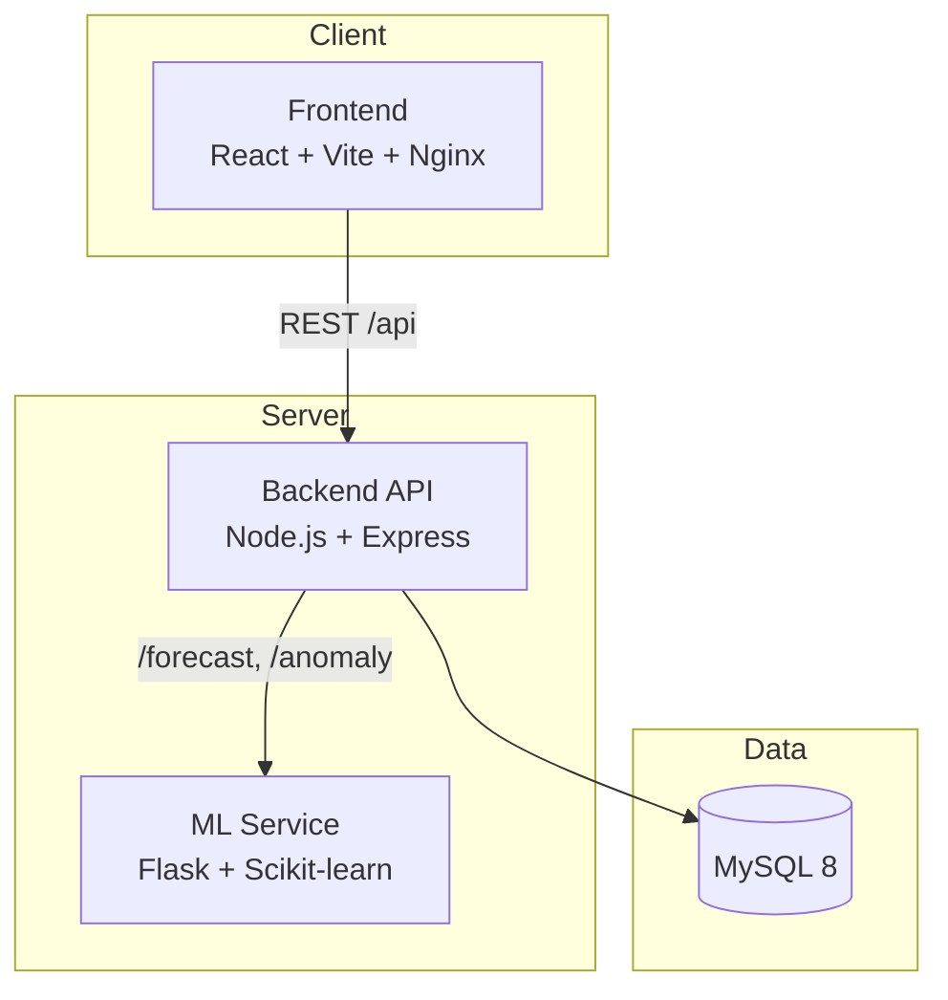

# SpendWise Pro 💰🤖


**AI-powered Personal Finance Management Platform** with expense tracking, budgeting, machine-learning forecasts, anomaly detection, and intelligent financial insights.

---

## 🚀 Live Demo

- Frontend: Coming Soon
- Backend API: Coming Soon

---

## Table of Contents

- [Features](#features)
- [Tech Stack](#tech-stack)
- [Architecture](#architecture)
- [Project Structure](#project-structure)
- [Screenshots](#screenshots)
- [Local Development](#local-development)
- [Environment Variables](#environment-variables)
- [API Overview](#api-overview)
- [Author](#author)
- [License](#license)

---

## Features

| Area | Capabilities |
|------|-------------|
| **Expense Tracking** | Add, update, and delete expenses with categories, notes, and dates |
| **Budget Management** | Set overall or per-category monthly budgets and track utilization |
| **Analytics Dashboard** | Monthly trends, category breakdowns, top spending categories, and summaries |
| **AI Financial Assistant** | Natural-language queries about spending, budgets, forecasts, and profile |
| **Spending Forecasting** | Linear Regression–based next-month spending predictions with MAE, RMSE, and R² |
| **Anomaly Detection** | Isolation Forest flags unusual transactions against spending history |
| **Intelligent Insights** | Auto-generated insights and savings recommendations |
| **Financial Health** | Health score, budget-breach predictions, and overspending alerts |
| **Notifications** | In-app alerts for budget and spending events |
| **Authentication** | JWT-based auth with email verification and password reset |
| **Profile & Avatar** | Profile management with secure avatar upload (Multer) |
| **Security** | Helmet, rate limiting, input validation, and CORS hardening |
| **DevOps** | Fully Dockerized multi-service architecture |

---

## Tech Stack

### Frontend
- React 19 + TypeScript
- Vite
- Tailwind CSS 4
- Recharts
- React Router
- Axios

### Backend
- Node.js + Express.js
- MySQL 8
- JWT Authentication
- bcrypt
- Multer
- Nodemailer
- Helmet
- express-rate-limit
- express-validator

### Machine Learning
- Flask
- Scikit-learn
  - Linear Regression (Forecasting)
  - Isolation Forest (Anomaly Detection)
- Pandas
- NumPy

### DevOps
- Docker
- Docker Compose
- Nginx

---

## Architecture



| Service | Port | Description |
|---------|------|-------------|
| Frontend | `80` | React SPA served via Nginx |
| Backend | `5000` | REST API and business logic |
| ML Service | `5001` | Forecasting and anomaly detection |
| MySQL | `3307` (host) → `3306` (container) | Persistent data storage |

---

## Project Structure

```
SpendWise-Pro/
├── Backend/
│   ├── controllers/
│   ├── routes/
│   ├── services/
│   ├── middleware/
│   ├── schema/
│   └── uploads/
├── Frontend/
│   └── src/
├── ML-Service/
│   ├── app.py
│   ├── model.py
│   └── anomaly.py
├── docker-compose.yml
├── .env.example
└── README.md
```

---

## Screenshots

🚧 Screenshots coming soon.

---

## Quick Start (Docker)

### Prerequisites

- Docker Desktop
- Docker Compose

### Clone Repository

```bash
git clone https://github.com/IshaanSaxena2005/SpendWise-Pro.git
cd SpendWise-Pro
```

### Configure Environment

```bash
cp .env.example .env
```

Update `.env` with:

- JWT_SECRET
- SMTP_USER
- SMTP_PASS

### Start All Services

```bash
docker compose up --build
```

### Access Application

| Service | URL |
|---------|-----|
| Frontend | http://localhost |
| Backend API | http://localhost:5000 |
| ML Health | http://localhost:5001/health |
| MySQL | localhost:3307 |

Stop services:

```bash
docker compose down
```

---

## Local Development

### Database

```bash
mysql -u root -p -e "CREATE DATABASE spendwise;"
mysql -u root -p spendwise < Backend/schema/schema.sql
```

### Backend

```bash
cd Backend
npm install
npm start
```

### ML Service

```bash
cd ML-Service
pip install -r requirements.txt
python app.py
```

Runs on: `http://localhost:5001`

### Frontend

```bash
cd Frontend
npm install
npm run dev
```

Runs on: `http://localhost:5173`

---

## Environment Variables

Create `.env` files using `.env.example`.

Important variables:

```env
JWT_SECRET=
DB_HOST=
DB_USER=
DB_PASSWORD=
DB_NAME=spendwise
ML_SERVICE_URL=http://ml-service:5001
SMTP_USER=
SMTP_PASS=
VITE_API_BASE_URL=http://localhost:5000/api
```

---

## API Overview

| Prefix | Purpose |
|--------|---------|
| `/api/auth` | Authentication |
| `/api/expenses` | Expense CRUD |
| `/api/categories` | Category CRUD |
| `/api/budgets` | Budget CRUD |
| `/api/analytics` | Dashboard analytics |
| `/api/forecast` | ML forecasting |
| `/api/anomaly` | Anomaly detection |
| `/api/ai` | AI assistant |
| `/api/intelligence` | Recommendations |
| `/api/notifications` | Notifications |
| `/api/user` | Avatar management |

### ML Service Endpoints

| Method | Endpoint |
|--------|----------|
| GET | `/health` |
| POST | `/forecast` |
| POST | `/anomaly` |

---

## Author

**Ishaan Saxena**

- GitHub: https://github.com/IshaanSaxena2005
- Project: SpendWise Pro
- Full-stack AI-powered personal finance platform

---

## License

This project is licensed under the **MIT License**.