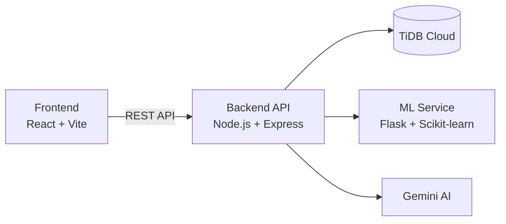

# SpendWise Pro 💰🤖


**AI-powered Personal Finance Management Platform** featuring intelligent expense tracking, self-learning transaction categorization, recurring income & expenses, financial goals, budgeting, analytics, ML-powered forecasting, anomaly detection, Gemini-powered financial assistance, automated email insights, and secure cloud deployment.

---

## 🚀 Live Demo

- Frontend: https://spendwise-pro-nu.vercel.app/

---

## Table of Contents

- [Features](#features)
- [Tech Stack](#tech-stack)
- [Architecture](#architecture)
- [Project Structure](#project-structure)
- [Screenshots](#screenshots)
- [Local Development](#local-development)
- [Environment Variables](#environment-variables)
- [API Overview](#api-overview)
- [Deployment](#deployment)
- [Copyright & License](#copyright--license)
- [Author](#author)

---

## Features

| Area | Capabilities |
|------|--------------|
| **Smart Expense Tracking** | Add, edit, delete, search, filter and export transactions |
| **Self-Learning AI Categorization** | Hybrid categorization using user learning, merchant aliases, keyword/fuzzy matching, TF-IDF + Logistic Regression ML, and Gemini fallback |
| **Recurring Transactions** | Daily, weekly, monthly and yearly recurring expenses & income |
| **Smart Financial Goals** | Goal-linked transactions, automatic progress tracking, remaining amount, completion prediction and milestone notifications |
| **Budget Management** | Overall and category-wise budgets with utilization tracking |
| **Analytics Dashboard** | Spending trends, category breakdown, savings insights and monthly summaries |
| **AI Financial Assistant** | Natural language financial queries powered by Gemini AI |
| **Spending Forecasting** | Machine learning prediction of future expenses |
| **Anomaly Detection** | Isolation Forest based unusual spending detection |
| **Financial Health Score** | Personalized financial health analysis with recommendations |
| **Email Notifications** | Budget warnings, budget exceeded alerts, monthly financial reports and weekly AI spending insights |
| **Authentication & Security** | JWT, Email Verification, Password Reset, Google OAuth, Rate Limiting |
| **Profile Management** | Avatar upload and profile customization |
| **Cloud Deployment** | Production-ready deployment on Vercel + Render + TiDB Cloud |


---

## Tech Stack

### Frontend

- React 19 + TypeScript
- Vite
- Tailwind CSS
- React Router
- Axios
- Recharts

### Backend

- Node.js + Express.js
- MySQL 8
- JWT Authentication
- bcrypt
- Multer
- Nodemailer
- Helmet
- express-rate-limit
- express-validator
- MySQL / TiDB Cloud
- Google Gemini API
- Brevo Email API

### AI & Machine Learning

- Python
- Flask
- Scikit-learn
- Pandas
- NumPy
- TF-IDF Vectorization
- Logistic Regression
- Linear Regression
- Isolation Forest
- Rule-based NLP
- Fuzzy String Matching
- Self-Learning Categorization
- Google Gemini AI

## Architecture



| Service     | Platform   |
| ----------- | ---------- |
| Frontend    | Vercel     |
| Backend API | Render     |
| Database    | TiDB Cloud |
| ML Service  | Render     |
| AI Provider | Google Gemini |

---

## Project Structure

```text
SpendWise-Pro/
├── Backend/
│   ├── controllers/
│   ├── routes/
│   ├── services/
│   ├── middleware/
│   ├── schema/
│   └── uploads/
├── Frontend/
│   └── src/
├── ML-Service/
│   ├── app.py
│   ├── model.py
│   └── anomaly.py
├── screenshots/
│   ├── home.png
│   ├── login.png
│   ├── dashboard.png
│   ├── transactions.png
│   ├── budgets.png
│   ├── analytics.png
│   ├── chatbot.png
│   └── profile.png
├── .env.example
└── README.md

```

## 📸 Screenshots

### 🏠 Landing Page


### 🔐 Login


### 📊 Dashboard


### 💰 Expense Management


### 🎯 Budget Management


### 📈 Analytics Dashboard


### 🤖 AI Financial Assistant


### 👤 User Profile


---

## Local Development

### Database

```bash
mysql -u root -p -e "CREATE DATABASE spendwise;"
mysql -u root -p spendwise < Backend/schema/schema.sql
```

### Backend

```bash
cd Backend
npm install
npm start
```

Runs on: `http://localhost:5000`

### ML Service

```bash
cd ML-Service
pip install -r requirements.txt
python app.py
```

Runs on: `http://localhost:5001`

### Frontend

```bash
cd Frontend
npm install
npm run dev
```

Runs on: `http://localhost:5173`

---

## Environment Variables

```env
PORT=5000

BACKEND_URL=
FRONTEND_URL=
CORS_ORIGIN=
ML_SERVICE_URL=

DB_HOST=
DB_PORT=3306
DB_USER=
DB_PASSWORD=
DB_NAME=

JWT_SECRET=
NODE_ENV=production

GOOGLE_CLIENT_ID=

CLOUDINARY_CLOUD_NAME=
CLOUDINARY_API_KEY=
CLOUDINARY_API_SECRET=

GEMINI_API_KEY=

BREVO_API_KEY=
BREVO_SENDER_EMAIL=

CRON_SECRET=
BUDGET_WARNING_THRESHOLD=0.8
```

### Frontend

```env
VITE_API_BASE_URL=
VITE_GOOGLE_CLIENT_ID=
```

---

## API Overview

| Prefix               | Purpose                         |
| -------------------- | ------------------------------- |
| `/api/auth`          | Authentication                  |
| `/api/expenses`      | Expense & income transactions   |
| `/api/categories`    | Category management             |
| `/api/budgets`       | Budget management               |
| `/api/analytics`     | Financial analytics             |
| `/api/forecast`      | ML spending forecasting         |
| `/api/anomaly`       | Anomaly detection               |
| `/api/ai`            | Gemini AI assistant             |
| `/api/intelligence`  | Financial insights              |
| `/api/notifications` | In-app notifications            |
| `/api/user`          | User/profile management         |
| `/api/goals`         | Smart financial goals           |
| `/api/recurring`     | Recurring transactions          |
| `/api/categorize`    | Smart transaction categorization|
| `/api/email`         | Email reports and scheduled insights |

### ML Service Endpoints

| Method | Endpoint    | Purpose                    |
| ------ | ----------- | -------------------------- |
| GET    | `/health`   | ML service health check    |
| POST   | `/categorize` | ML transaction categorization |
| POST   | `/forecast` | Spending forecast         |
| POST   | `/anomaly`  | Anomaly detection          |

---

## Deployment

SpendWise Pro is deployed using a cloud-based architecture:

- **Frontend:** Vercel
- **Backend API:** Render
- **Database:** TiDB Cloud
- **ML Service:** Render
- **AI:** Google Gemini
- **Email:** Brevo

---

## ⭐ Highlights

- 🧠 Self-Learning AI Transaction Categorization
- 🤖 Gemini-Powered Financial Assistant
- 📊 Interactive Financial Analytics
- 🎯 Smart Financial Goals & Milestones
- 💰 Budget Tracking & Intelligent Alerts
- 📧 Automated Monthly Reports & Weekly AI Insights
- 🔁 Recurring Income & Expense Management
- 📈 ML-Powered Spending Forecasting
- 🚨 Isolation Forest Anomaly Detection
- 🔐 Secure Authentication & Cloud Deployment

---

## Copyright & License

SpendWise Pro is developed by Ishaan Saxena. The project source code is proprietary.

No permission is granted for unauthorized copying, redistribution, modification, or commercial use without prior written permission from the copyright holder.

Third-party libraries, frameworks, fonts, icons, APIs and services used in this project remain subject to their respective licenses.

For details, see the [LICENSE](LICENSE) file.

---

## Author

**Ishaan Saxena**

- GitHub: https://github.com/IshaanSaxena2005
- Project: SpendWise Pro
- Full-stack AI-powered personal finance platform

---